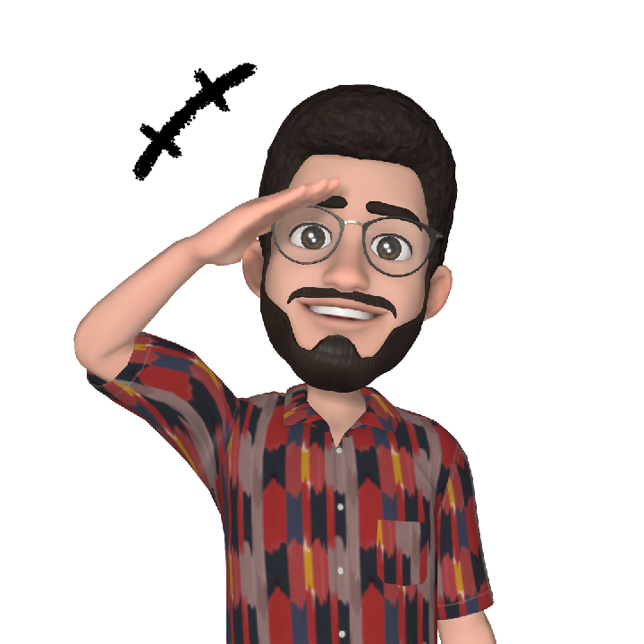

# Curso de HTML 5 e CSS 3

Meus desafios realizados durante o curso de HTML e CSS (40h) ministrado pelo professor Gustavo Guanabara do canal Curso em Vídeo.

### Desafios:

1. Desafio das mensagens: quebra de linhas, p.
2. Desafio das imagens: img, favicon, emojis.
3. Desafio do mapa: img, quebra de linhas.
4. Meus emojis favoritos: emojis, listas.
5. Minhas redes sociais: img, âncoras, listas.
6. Tags em HTML: uso da tag abbr.
7. Imagem flexível: adaptação da imagem com a tag picture.
8. Desafio da navegação: links internos.
9. Vídeos legais do meu canal: img, links internos e externos, vídeos.
